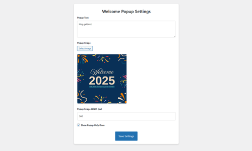
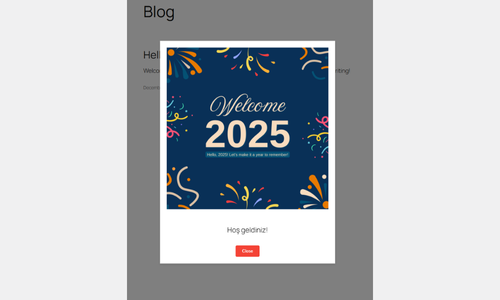

# Welcome Popup Eklentisi - WordPress

**Welcome Popup** eklentisi, siteye giriş yapan kullanıcılara bir popup göstererek onlara özel bir mesaj ve resim sunmanıza olanak tanır. Eklenti, popup'ın her seferinde mi yoksa yalnızca bir defa mı gösterileceğini admin panelinden ayarlamanıza imkan verir.

## Özellikler

- **Özelleştirilebilir Metin**: Popup içerisinde göstereceğiniz metni özelleştirebilirsiniz.
- **Resim Yükleme**: Popup'ta gösterilecek resmi yükleyebilirsiniz.
- **Resim Genişliği**: Yüklenen resmin genişliğini piksel cinsinden belirleyebilirsiniz.
- **Bir Defa Gösterme Seçeneği**: Popup'ın yalnızca bir defa mı yoksa her seferinde mi gösterileceğini belirleyebilirsiniz.
- **Admin Paneli Ayarları**: Kolayca admin paneli üzerinden ayarları yapılandırabilirsiniz.

## Kurulum

1. **Eklentiyi İndirin**:

   - Bu repository'yi klonlayın ya da ZIP dosyasını indirin.

2. **Eklentiyi Yükleyin**:

   - WordPress Admin Paneli'ne gidin.
   - `Eklentiler` > `Yeni Ekle` > `Eklenti Yükle` bölümüne gidin.
   - `welcome-popup.zip` dosyasını yükleyin veya GitHub'dan doğrudan repository'yi klonlayarak yükleyin.

3. **Eklentiyi Etkinleştirin**:

   - Yükleme işlemi tamamlandıktan sonra, WordPress Admin Paneli'nde `Eklentiler` menüsünden bu eklentiyi etkinleştirin.

4. **Ayarları Yapılandırın**:
   - Eklenti etkinleştirildikten sonra, Admin Paneli'nde yeni eklenen "Popup Ayarları" menüsüne gidin.
   - Buradan popup için metin, resim, resim genişliği ve bir defa gösterme seçeneğini yapılandırabilirsiniz.

## Kullanım

- Eklenti etkinleştirildikten ve ayarlar yapıldıktan sonra, belirlediğiniz ayarlara göre popup sitenizde görüntülenir.
- Popup, yüklediğiniz resim ve metin ile görüntülenir ve resim genişliğini admin panelinden ayarlayabilirsiniz.
- Popup, kapama butonuna ya da sayfa dışındaki alanlara tıklanarak kapatılabilir.

## Admin Paneli Ayarları

- **Popup Metni**: Popup içerisinde görünen metni buraya yazabilirsiniz.
- **Popup Resmi**: Popup'ta görüntülenecek resmi yükleyebilirsiniz.
- **Popup Resim Genişliği (px)**: Yüklenen resmin genişliğini burada belirleyebilirsiniz.
- **Popup Sadece Bir Defa Gösterilsin**: Eğer bu seçeneği işaretlerseniz, popup yalnızca bir defa gösterilir (cookie kullanılır).

## Nasıl Çalışır

1. **Admin Ayarları**:

   - Eklenti, Admin Paneli'nde "Popup Ayarları" menüsü ekler. Buradan popup için metin, resim ve genişlik ayarlarını yapabilirsiniz.
   - Ayrıca, popup'ın sadece bir defa mı yoksa her seferinde mi gösterileceğini belirleyen bir checkbox seçeneği vardır.

2. **Frontend (Ön Yüz)**:

   - Kullanıcılar sitenize geldiğinde popup, admin panelinde yaptığınız ayarlara göre görüntülenir.
   - "Sadece Bir Defa Göster" seçeneğini işaretlerseniz, popup yalnızca bir defa görüntülenir. Ziyaretçi sonraki ziyaretlerinde popup'ı görmez.

3. **Popup Kapatma**:
   - Popup, kapama butonuna tıklanarak ya da sayfa dışındaki alanlara tıklanarak kapatılabilir.

## Ekran Görüntüleri

- **Admin Paneli**:
  

- **Frontend Popup**:
  

## Katkı Sağlama

Katkılarınızı bekliyoruz! Lütfen repository'yi çatallayarak ve iyileştirme veya hata düzeltmeleri için pull request (PR) göndererek katkıda bulunun.

### Katkı Sağlamak İçin

1. Repository'yi çatallayın.
2. Çatalladığınız repository'yi yerel makinenize klonlayın.
3. Yeni bir branch (dal) oluşturun.
4. Gerekli değişiklikleri yapın ve commit edin.
5. Yapmış olduğunuz değişiklikleri kendi fork'ınıza push (yükleyin).
6. Ana repository'ye bir pull request (PR) gönderin.

## Lisans

Bu eklenti, [MIT Lisansı](LICENSE) altında lisanslanmıştır.

## İletişim

Herhangi bir sorunuz veya öneriniz varsa, GitHub repository'sinde bir issue (sorun) açabilirsiniz.
